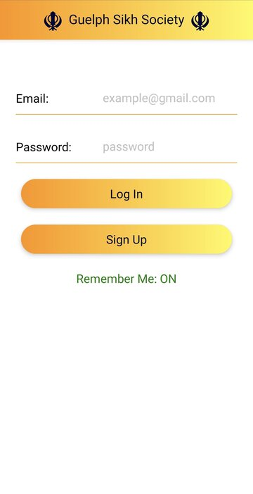
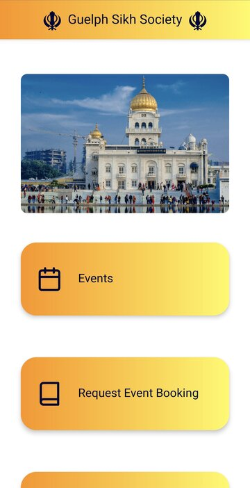
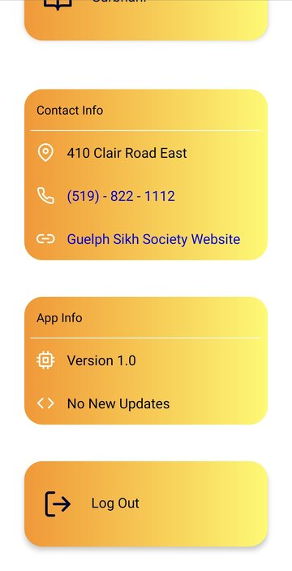
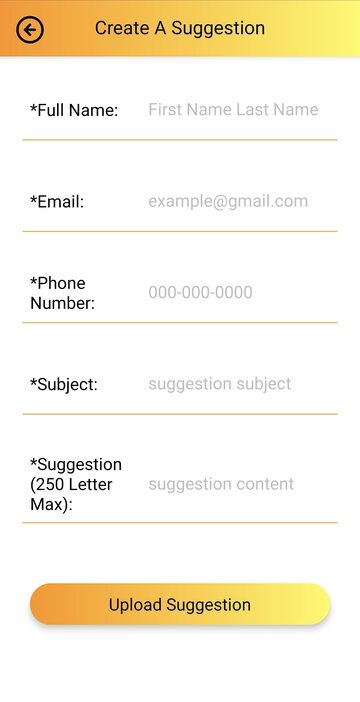
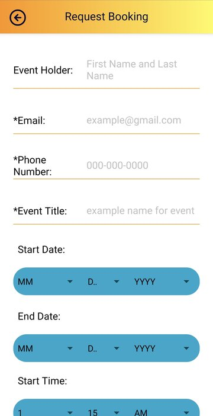
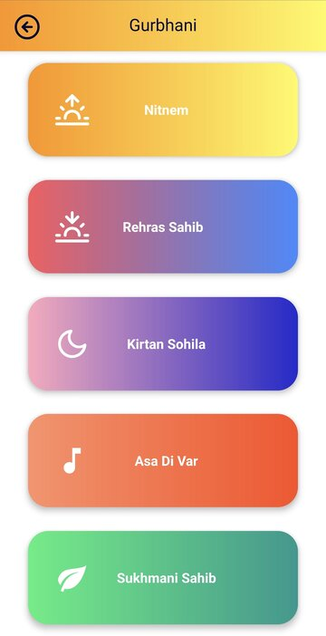

# Guelph Sikh Society App

The Guelph Sikh Society App was developed to provide the Sikh community in Guelph to interact and communicate their ideas, and feedback to the Guelph Sikh Society Council.
It also served as a way to engage the youth of the Sikh community in Guelph.

## Features
The app allowed community members to view information about the Guelph Sikh Society. This included the phone number, Gurudwara address, and an easy to find link to the website.
Furthermore, the app allowed community members to easily send suggestions they had for improving the Gurudwara and request bookings for events including prayers, weddings, etc.
Finally, the app also provided users with easy access to the 5 daily prayer scriptures directly on their phones.

## Tech Stack
The app front-end was developed using React Native for both iOS and Android. The back-end was developed using Google Firebase. This included Firebase Authentication for 
handling verification of accounts, resetting passwords, and creating accounts. Additionally, Firebase Firestore NoSQL JSON database was used to store user data, event bookings,
and suggestion data.

## Images
 
 
 
 
 
 
